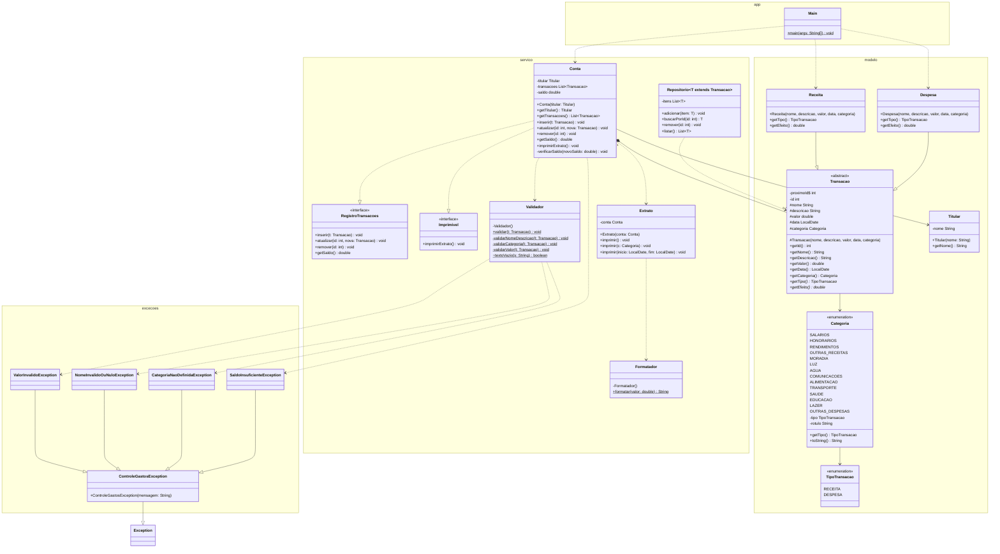

# Diagrama de classes – Controle de Gastos

```mermaid
classDiagram
direction TB

class Exception

namespace excecoes {
    class ControleGastosException {
        +ControleGastosException(mensagem: String)
    }
    class ValorInvalidoException
    class NomeInvalidoOuNuloException
    class CategoriaNaoDefinidaException
    class SaldoInsuficienteException
}

namespace modelo {
    class Transacao {
        <<abstract>>
        -proximoId$ int
        -id int
        #nome String
        #descricao String
        #valor double
        #data LocalDate
        #categoria Categoria
        #Transacao(nome, descricao, valor, data, categoria)
        +getId() int
        +getNome() String
        +getDescricao() String
        +getValor() double
        +getData() LocalDate
        +getCategoria() Categoria
        +getTipo()* TipoTransacao
        +getEfeito()* double
    }
    class Receita {
        +Receita(nome, descricao, valor, data, categoria)
        +getTipo() TipoTransacao
        +getEfeito() double
    }
    class Despesa {
        +Despesa(nome, descricao, valor, data, categoria)
        +getTipo() TipoTransacao
        +getEfeito() double
    }
    class TipoTransacao {
        <<enumeration>>
        RECEITA
        DESPESA
    }
    class Categoria {
        <<enumeration>>
        SALARIOS
        HONORARIOS
        RENDIMENTOS
        OUTRAS_RECEITAS
        MORADIA
        LUZ
        AGUA
        COMUNICACOES
        ALIMENTACAO
        TRANSPORTE
        SAUDE
        EDUCACAO
        LAZER
        OUTRAS_DESPESAS
        -tipo TipoTransacao
        -rotulo String
        +getTipo() TipoTransacao
        +toString() String
    }
    class Titular {
        -nome String
        +Titular(nome: String)
        +getNome() String
    }
}

namespace servico {
    class RegistroTransacoes {
        <<interface>>
        +inserir(t: Transacao) void
        +atualizar(id: int, nova: Transacao) void
        +remover(id: int) void
        +getSaldo() double
    }
    class Imprimivel {
        <<interface>>
        +imprimirExtrato() void
    }
    class Conta {
        -titular Titular
        -transacoes List~Transacao~
        -saldo double
        +Conta(titular: Titular)
        +getTitular() Titular
        +getTransacoes() List~Transacao~
        +inserir(t: Transacao) void
        +atualizar(id: int, nova: Transacao) void
        +remover(id: int) void
        +getSaldo() double
        +imprimirExtrato() void
        -verificarSaldo(novoSaldo: double) void
    }
    class Validador {
        -Validador()
        +validar(t: Transacao)$ void
        -validarNomeDescricao(t: Transacao)$ void
        -validarCategoria(t: Transacao)$ void
        -validarValor(t: Transacao)$ void
        ~textoVazio(s: String)$ boolean
    }
    class Extrato {
        -conta Conta
        +Extrato(conta: Conta)
        +imprimir() void
        +imprimir(c: Categoria) void
        +imprimir(inicio: LocalDate, fim: LocalDate) void
    }
    class Formatador {
        -Formatador()
        +formatar(valor: double)$ String
    }
    class Repositorio~T extends Transacao~ {
        -itens List~T~
        +adicionar(item: T) void
        +buscarPorId(id: int) T
        +remover(id: int) void
        +listar() List~T~
    }
}

namespace app {
    class Main {
        +main(args: String[])$ void
    }
}

Receita --|> Transacao
Despesa --|> Transacao
ControleGastosException --|> Exception
ValorInvalidoException --|> ControleGastosException
NomeInvalidoOuNuloException --|> ControleGastosException
CategoriaNaoDefinidaException --|> ControleGastosException
SaldoInsuficienteException --|> ControleGastosException

Conta ..|> RegistroTransacoes
Conta ..|> Imprimivel

Conta "1" *-- "0..*" Transacao
Conta --> Titular
Transacao --> Categoria
Categoria --> TipoTransacao

Conta ..> Validador
Conta ..> Extrato
Conta ..> SaldoInsuficienteException
Validador ..> NomeInvalidoOuNuloException
Validador ..> CategoriaNaoDefinidaException
Validador ..> ValorInvalidoException
Extrato ..> Formatador
Repositorio ..> Transacao
Main ..> Conta
Main ..> Receita
Main ..> Despesa
```

Legenda: `-` private, `#` protected, `~` pacote, `+` public, `$` estático, `*` abstrato.
